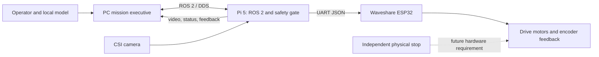

# Rover

This project is developing an outdoor utility rover for hauling and towing garden equipment. Software and control are being prototyped first on a small Waveshare UGV02, with the longer-term goal of transferring the autonomy interfaces to a larger custom rover.

The repository currently contains the design and commissioning documentation. It does not yet contain a deployable rover software stack, and the hardware has not been commissioned here. Treat hardware details and software choices as a plan until they are checked against the delivered unit.

## How It Works

The intended system keeps high-level intelligence on the PC and deterministic control on the rover. ROS 2/DDS carries commands, status, and camera data across the local network. On the Pi, a safety gate accepts only fresh, bounded commands; a project-owned ROS driver translates them to the ESP32's UART JSON protocol. The ESP32 runs the low-level motor controller.

The model proposes bounded task-level actions; it does not send motor PWM or write directly to the serial interface. The Pi must stop motion when commands expire or a fault is detected. Any physical emergency stop must operate independently of the PC, ROS, and model.

## Current Baseline

- Prototype: Waveshare UGV02 6x4 chassis, Raspberry Pi 5, and Camera Module 3 Wide.
- Pi software baseline: Ubuntu Server 24.04 ARM64 and ROS 2 Jazzy, subject to passing the CSI camera capture and ROS image-publication test.
- Base interface: retain factory ESP32 firmware initially; implement a thin Pi-side ROS-to-JSON serial bridge because Waveshare's `ugv_base_ros` repository is firmware, not a ROS 2 host driver.
- PC role: operator interface, perception, and mission-level model; ordinary navigation and safety software constrain movement.
- Status: planning and pre-commissioning. Board revision, UART pinout, Pi power budget, and camera compatibility remain to be verified on the actual hardware.

## Read The Docs

Suggested order for a new contributor or coding session:

1. [Project notes](docs/project/PROJECT_NOTES.md): goals, current decisions, staged implementation plan, and remaining unknowns.
2. [Project handoff](docs/project/ROVER_HANDOFF.md): hardware inventory, assumptions, and constraints to recheck.
3. [Pi and ESP32 commissioning](docs/hardware/PI5_ROS_ESP32_SETUP_PLAN.md): selected software baseline and bench bring-up sequence.
4. [ROS architecture](docs/architecture/ROS_ARCHITECTURE.md): nodes, data and command paths, ownership, and failure behavior.
5. [Action model research](docs/research/ACTION_MODEL_RESEARCH.md): PC-side model recommendation and bounded action interface.
6. [External references](docs/research/EXTERNAL_REFERENCES.md): vendor, platform, and research sources.

## Safety And Verification

Do not infer the delivered board revision or connect unverified power/UART pins from a product listing. Use a separate, appropriately rated Pi supply during bench bring-up. First movement tests must be low speed with the wheels raised, and the ESP32's documented heartbeat timeout is only a backup to the faster Pi-side command timeout. The rover is not ready for autonomous operation until stop behavior, command freshness, power stability, and camera/data paths have been tested.
