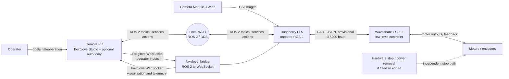
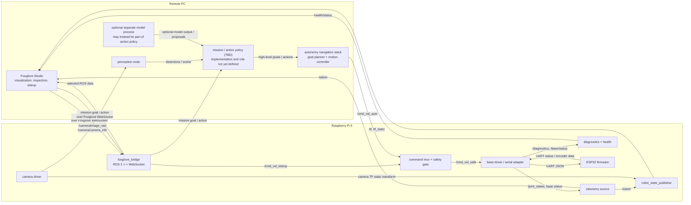
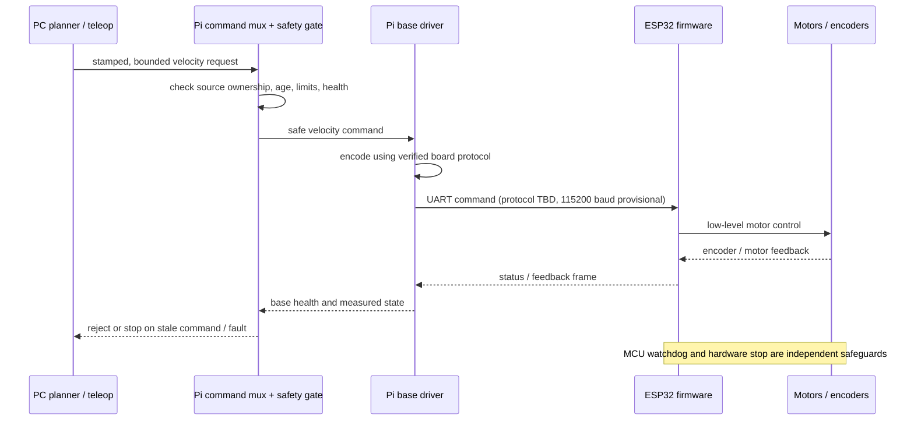

# Rover ROS 2 architecture

This document defines the intended communication architecture for the UGV02 prototype. It is a software design baseline, not confirmation of the installed board, firmware, topic names, or serial protocol. Confirm those against the delivered hardware and firmware before implementation.

## Design goals

- Keep model output away from direct motor control.
- Keep the robot safe and stoppable if the remote PC or Wi-Fi disappears.
- Isolate Waveshare-specific serial details behind a base-driver interface.
- Keep the future rover's autonomy interfaces independent of its eventual drivetrain.
- Make data ownership and command direction unambiguous.

## System context

The Pi is the boundary between networked autonomy and the physical base. It must enforce local command freshness and safe-stop behavior; the PC is not part of the emergency-stop chain. Any hardware E-stop must act independently of ROS and model software.

## ROS deployment and node graph

The following graph shows the planned nodes and topic direction. Names are logical names, not frozen ROS names. Foxglove Studio is the remote operator and visualization application; `foxglove_bridge` runs on the Pi and exposes selected ROS 2 data over WebSocket. Autonomy nodes are separate ROS 2 processes and may run alongside Studio on the PC. The base driver may be a vendor ROS node or a project adapter, depending on the verified firmware interface.

Foxglove is not the mission planner. Studio is an operator-facing application for viewing ROS data, inspecting the graph, and optionally sending explicit operator inputs such as teleoperation commands or a mission goal. The bridge transports those inputs and selected ROS data; it does not decide what the robot should do. Autonomy ROS nodes exchange data directly over ROS 2/DDS and should not depend on the Studio process being open.

### Mission / action policy: open design

The mission/action-policy box is intentionally unresolved; it does not commit the project to a conventional deterministic mission executive. It could be an AI action model, a behavior tree or state machine, a task planner, a hybrid of these, or a different high-level decision component. The implementation may be one ROS node or multiple nodes, and the model may be embedded in that component or called as a separate service.

The architecture only requires a stable boundary: this component consumes goals and relevant state/perception, then requests high-level actions or navigation goals. Its outputs are not trusted motor commands. They must pass through the navigation/control path and the Pi's command mux and safety gate. The model, policy, action vocabulary, validation rules, and recovery behavior all remain to be defined.

The navigation stack is shown as a separate role to make the safety boundary visible, not to lock in Nav2 or a specific planner. It would turn an accepted navigation goal into motion requests such as `/cmd_vel_auto`; whether this is Nav2, custom software, or part of a future combined policy is open. Its location (PC or Pi) is also undecided.

### Command authority

There is one command path to the base:

`teleop or autonomy -> command mux and safety gate -> base driver -> ESP32 -> motors`

- Teleoperation and autonomy publish separate inputs. They do not publish directly to the serial driver.
- The mux selects the active owner and rejects commands from inactive sources.
- The safety gate bounds velocity, rejects stale input, and emits zero velocity on timeout, fault, or loss of command ownership.
- The base driver owns serial framing, protocol translation, response parsing, and hardware-specific limits. It must also enforce a local serial command timeout if supported by the firmware.
- The ESP32 remains responsible for its low-level motor loop and its own watchdog behavior.
- A hardware E-stop, where present, overrides every software layer.

If the vendor driver already provides muxing or safety behavior, retain a single authoritative implementation for each responsibility. Do not add a second controller that independently republishes or integrates `cmd_vel`.

## Interface and topic contract

These are proposed logical interfaces. Confirm message types, names, units, rates, QoS, and firmware capabilities during bring-up.

| Interface | Direction | Owner | Purpose |
|---|---|---|---|
| `/cmd_vel_teleop` (`geometry_msgs/msg/Twist`) | PC -> Pi | Teleop | Manual velocity request; never connected directly to the serial port |
| `/cmd_vel_auto` (`geometry_msgs/msg/Twist`) | Autonomy stack -> Pi | Navigation controller | Autonomy velocity request; subject to onboard arbitration and limits |
| `/cmd_vel_safe` (`geometry_msgs/msg/Twist`) | Pi internal | Command mux/safety gate | Sole velocity command consumed by the base driver |
| Mission goal/action (interface TBD) | Operator UI -> mission executive | Mission executive | High-level task input; not a motor command and not consumed by the velocity mux |
| `/camera/image_raw` (`sensor_msgs/msg/Image`) | Pi -> PC | Camera driver | Camera frames; transport/QoS should be chosen for bandwidth and latency |
| `/camera/camera_info` (`sensor_msgs/msg/CameraInfo`) | Pi -> PC | Camera driver | Camera calibration accompanying the image stream |
| `/joint_states` (`sensor_msgs/msg/JointState`) | Pi -> consumers | Base driver | Wheel position/velocity if the ESP32 exposes usable encoder data |
| `/odom` (`nav_msgs/msg/Odometry`) | Pi -> PC | One selected odometry source | Base pose and twist estimate; do not publish competing odometry authorities |
| `/tf`, `/tf_static` | Pi -> PC | State publisher / odometry | Robot and sensor frame tree |
| `/base/status` (proposed custom message or diagnostics) | Pi -> PC | Base driver | Connection state, firmware identity, measured values, and fault state |
| `/diagnostics` (`diagnostic_msgs/msg/DiagnosticArray`) | Pi -> PC | Drivers and health monitor | Component health, stale-data and hardware faults |

Command timestamps and expiry must be explicit. `Twist` itself has no header, so use a stamped command type or a companion timestamp/lease mechanism at the PC-to-Pi boundary. Do not treat DDS delivery as proof that a command is fresh.

## Pi-to-ESP32 boundary

Protocol facts such as JSON framing, line endings, command fields, heartbeat timing, feedback schema, UART pins, and watchdog timeout are not yet verified for the actual board/firmware revision. Keep them in a hardware-specific driver configuration and test on a bench with wheels raised before floor testing.

## Data ownership

- Camera driver: camera capture, image timestamps, camera calibration, and camera topics.
- Command mux/safety gate: active control source, freshness checks, speed limits, and software stop requests.
- Base driver: serial connection lifecycle, protocol conversion, board identification, and raw base feedback.
- ESP32 firmware: motor control loop and firmware watchdog, subject to verified capabilities.
- Odometry source: exactly one source publishes the authoritative `/odom` and corresponding `odom -> base_link` transform.
- `robot_state_publisher`: publishes the URDF-defined fixed and articulated robot transforms; it does not estimate odometry.
- Planner/model: produces intent or bounded motion requests; it does not access UART or motor outputs.

## Networking and QoS

- Put PC and Pi on the same trusted local network and configure a fixed `ROS_DOMAIN_ID`.
- Confirm DDS discovery across the actual Wi-Fi/router setup before adding application nodes.
- Prefer reliable delivery for status, diagnostics, and low-rate control where appropriate. For camera images, use a sensor-data profile (typically best-effort, shallow history) if packet loss is preferable to accumulating stale frames.
- Keep command queues shallow and discard expired commands. Avoid replaying a queued velocity after a network interruption.
- Monitor command age, link state, serial state, and feedback age. A missing heartbeat or stale state should become a visible fault and a stop request.
- ROS 2 security and network exposure should be considered before connecting outside the trusted LAN.

## Failure behavior

| Failure | Required response |
|---|---|
| PC or Wi-Fi lost | Pi expires remote command and requests zero velocity; ESP32 watchdog stops motors if commands cease |
| Planner or teleop process exits | Mux detects source timeout and selects no motion / stop |
| Pi command gate or base driver fails | ESP32 watchdog stops motors when its verified timeout expires |
| UART disconnect or malformed status | Base driver reports fault; gate stops and blocks motion until recovery policy is satisfied |
| Camera unavailable | Report camera fault; inhibit tasks that require vision; do not silently claim perception is healthy |
| Pi reboot / power loss | ESP32 watchdog and independent hardware stop path provide the physical stop behavior |
| E-stop activated | Hardware removes or inhibits drive power independently of the Pi and ROS |

A software zero-velocity command is not a substitute for a physical E-stop or a verified MCU timeout. The prototype must establish what the shipped firmware actually does on communication loss.

## Launch and lifecycle outline

1. Start base driver and verify board identity, UART connection, and feedback.
2. Start diagnostics and health monitoring; keep command output inhibited until the base is healthy.
3. Start camera driver and robot description/state publisher.
4. Start command mux/safety gate in a disarmed state.
5. Start remote ROS 2 nodes and verify discovery, topics, timestamps, and QoS.
6. Explicitly arm manual low-speed testing; autonomy remains disabled.
7. Validate timeout, stop, disconnect, process-exit, and E-stop behavior before normal operation.

Exact launch files and arming interface are implementation work and depend on the verified board protocol and chosen ROS distribution.

## Decisions still open

- OS and ROS 2 distribution: pin one compatible combination before implementation; current setup notes discuss Ubuntu 24.04/Jazzy and Raspberry Pi OS as alternatives.
- Board variant and firmware: identify ROS Driver versus General Driver and use the matching vendor source/driver.
- Whether the vendor provides a maintained ROS 2 base node or only a host-side script/protocol example.
- UART device, pins, framing, JSON schema, command units, heartbeat period, and timeout behavior.
- Availability and meaning of encoder/IMU feedback, and whether odometry is computed on the ESP32 or Pi.
- Camera ROS driver, image transport, and calibration storage.
- Custom message definitions for base status and stamped/leased velocity commands.
- Required physical E-stop and motor power isolation for the prototype.

## First integration milestones

1. Capture exact board revision, firmware, and wiring in the hardware record.
2. Verify ROS 2 network discovery between PC and Pi with a talker/listener test.
3. Validate camera locally, then publish an image topic to the PC.
4. Verify serial status reads without enabling motor output.
5. Implement or select the base driver and test stop/timeout behavior with wheels raised.
6. Add command muxing and source ownership; test stale and conflicting commands.
7. Establish one odometry and TF authority from measured hardware behavior.
8. Run an end-to-end low-speed test with a human at the physical stop.

## Diagram source

The diagrams in this document are Mermaid source and render in compatible Markdown viewers. The architecture is also summarized in [PROJECT_NOTES.md](PROJECT_NOTES.md), while the hardware setup checklist is in [PI5_ROS_ESP32_SETUP_PLAN.md](PI5_ROS_ESP32_SETUP_PLAN.md).
