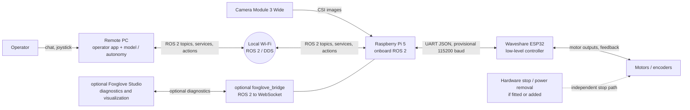
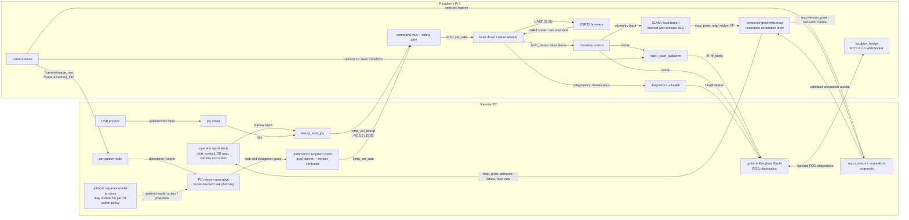
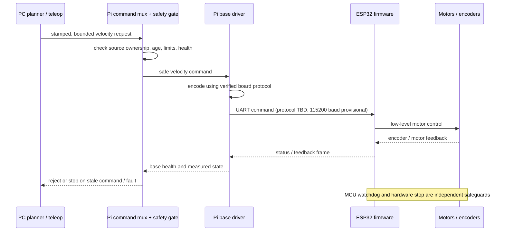

# Rover ROS 2 architecture

This document defines the intended communication architecture for the UGV02 prototype. It is a software design baseline, not confirmation of the installed board, firmware, topic names, or serial protocol. Confirm those against the delivered hardware and firmware before implementation.

## Design goals

- Keep model output away from direct motor control.
- Keep the robot safe and stoppable if the remote PC or Wi-Fi disappears.
- Isolate Waveshare-specific serial details behind a base-driver interface.
- Keep the future rover's autonomy interfaces independent of its eventual drivetrain.
- Make data ownership and command direction unambiguous.

## System context

The Pi is the boundary between networked autonomy and the physical base. It must enforce local command freshness and safe-stop behavior; the PC is not part of the emergency-stop chain. Any hardware E-stop must act independently of ROS and model software.

## ROS deployment and node graph

The following graph shows the planned nodes and topic direction. Names are logical names, not frozen ROS names. The project PC operator application is the primary user interface for conversational task requests, joystick teleoperation, and robot camera/status. It talks to PC-side mission and teleoperation components; those components use ROS 2/DDS for robot communication. Foxglove Studio and `foxglove_bridge` are optional development and diagnostics tools, not runtime requirements for the operator app. The project will provide the Pi-side base driver/serial adapter: the current Waveshare `ugv_base_ros` repository is ESP32 firmware, not a ROS 2 host node.

The project operator application is the primary user-facing app. Its initial scope is typed conversational task input, joystick teleoperation, a task-focused 2D map, and camera/robot/task status, with manual versus autonomy ownership made explicit. The map view should show the geometric occupancy map, robot pose/heading and localization health, semantic room/landmark annotations, active destination and planned route, and search/task progress. It reads the same versioned map and ROS navigation interfaces used by the mission executive; it must not become a second map authority. A simple room-label/edit action can support setup and recovery, but routine autonomous discovery should not require manual annotation. Voice input and the choice of desktop or web framework are open. The app submits semantic requests to the PC mission executive; it does not publish model-generated motor commands. The mission executive translates requests into bounded robot actions or navigation goals, monitors feedback, and can cancel or replan.

Use Foxglove Studio early as the development observability console for inspecting raw ROS topics, camera images with perception annotations, occupancy grids, transforms, diagnostics, and model/mission events. It remains optional at runtime: it is not the normal operator UI and the robot must not depend on Foxglove or `foxglove_bridge` to operate safely. The operator app should remain task-focused rather than reimplementing Foxglove's topic inspection, plotting, and rich debugging views. It may show a straightforward camera preview and the status needed to operate the robot; detailed detection overlays and internal ROS diagnostics belong in Foxglove unless operational testing demonstrates a clear need in the app. `foxglove_bridge` is only needed when using Studio or another Foxglove client.

Keep perception output as timestamped ROS data rather than baking labels and boxes into a duplicate video stream. Publish detections with the source image timestamp and pixel coordinates (for example, using `vision_msgs`), and expose a Foxglove-compatible image-annotation topic or small adapter for the Image panel. Keep the annotation timestamp tied to the image it describes so the overlay does not drift onto a newer frame. The operator app need not implement this visualization initially.

For debugging model behavior, publish structured decision/mission events that identify the observation or frame considered, relevant detections and confidence, the proposed task-level action, and the mission executive's validation/acceptance or rejection result. Provide concise evidence or rationale summaries where useful, not private chain-of-thought. These events should be inspectable in Foxglove and should never grant the model direct motor or safety authority.

For a physical USB joystick connected to the PC, the proposed default is `joy` to read the device and publish `/joy`, followed by `teleop_twist_joy` to map axes/buttons into `/cmd_vel_teleop`. That topic crosses the network directly over ROS 2/DDS to the Pi's command mux and safety gate, not through Foxglove. Configure a deadman/enable control and command timeout; the Pi remains responsible for rejecting stale input and stopping safely.

### Collaborative mapping and semantic annotations

The Pi is the operational source of truth for geometric mapping and localization: its selected SLAM/localization stack estimates robot pose and maintains the metric map used for navigation. Persist that map on the Pi. Sensor inputs and the specific mapping method remain open; the Camera Module 3 Wide is monocular RGB and does not itself provide a depth point cloud, while encoder availability and odometry quality still need hardware verification.

The PC model can help annotate the map, but it does not write raw geometry. The Pi sends the PC current pose, map identity/version, relevant semantic context, and selected camera frames (not necessarily a full point cloud or every video frame). The multimodal model may propose a structured annotation such as `room_candidate: kitchen`, a visible landmark, or an object observation with image/frame reference and confidence. A deterministic map manager checks coordinate frame, map version, pose validity, freshness, and schema. Supported annotations can be committed automatically when they meet configured evidence/confidence rules, for example consistent detections from multiple localized viewpoints. Low-confidence evidence triggers another bounded observation/recovery step before operator escalation; operator approval is not a routine prerequisite.

Keep semantic annotations in a versioned sidecar/layer associated with the geometric map, rather than mixing model-generated labels into occupancy values or treating conversational history as map storage. Example records include named room regions, landmark labels, and time-stamped object observations with confidence and source frame. The Pi persists the canonical map plus semantic layer; the PC may cache or back them up. Map metadata and updates can pass bidirectionally over ROS 2/DDS using low-rate topics and a validated service/action. Bulk map or point-cloud transfer is only needed when a consumer actually requires it. On network loss, the Pi retains its last committed map and the robot must not assume uncommitted model proposals exist.

The target runtime is autonomous mapping/exploration using the validated Pi mapping/localization and navigation stack, with the PC model supervising semantic discovery. During early commissioning, low-speed attended tests and a ready physical stop are still required until mapping, localization, and base safety are verified; this is a hardware-validation precaution, not an intended requirement to teleoperate every mapping pass. A single image can suggest “this looks like a kitchen,” but it cannot establish a persistent map coordinate without localization and a geometrically grounded pose.

For a request such as “go to the kitchen,” the PC mission executive looks up `kitchen` in the semantic map layer and checks that the annotation belongs to the current map version and has a usable region or navigation goal. The model can help interpret an ambiguous label or visual cue, but it should not calculate the geometric route. The mission executive submits the resolved goal to the ROS navigation stack, which plans a path over the geometric map and executes it through the normal command/safety path. The model need not stay in the motion loop; it can wait for action feedback and be consulted again if the destination is ambiguous, navigation reports blocked/failure, or a new observation is needed.

If no kitchen annotation exists but a usable geometric map and localization are available, the mission executive launches a bounded first-run semantic discovery task by default. It asks the navigation stack to visit selected, reachable scan viewpoints; at each point, the PC model inspects selected camera frames and proposes whether the view belongs to a kitchen, with evidence and confidence tied to the current robot pose and map version. The model supervises at the task level by choosing whether to inspect another viewpoint or conclude; the navigation stack handles route planning and movement. The mission executive limits search area/time and tries configured recovery steps if evidence is ambiguous, coverage is incomplete, or navigation fails. It commits a supported proposal automatically. Contact the operator only when the bounded search/recovery budget is exhausted, the destination remains unresolved, or a safety/health condition requires intervention. Later “go to the kitchen” requests resolve from the saved annotation without repeating discovery. If localization or a geometric map is unavailable, the autonomous mapping/exploration capability must first be established and validated; do not send an ungrounded room goal.

### PC mission executive and robot actions

The recommended design uses one local PC-side multimodal model for conversational interpretation, camera-image understanding, and proposing the next item from an allowlisted task/skill API. Qwen3-VL Instruct 4B with supported 4-bit quantization is an initial benchmark candidate, subject to measured memory and latency on the actual PC; the local development machine profile is documented separately in [DEVELOPMENT_PC_PROFILE.md](../hardware/DEVELOPMENT_PC_PROFILE.md). Deterministic mission logic validates and sequences the proposed actions; conventional ROS navigation controls movement. The Pi does not need a language model or semantic understanding of goals such as “find the sock.” No separate Jev/Clef decision model is planned for v1. See [ACTION_MODEL_RESEARCH.md](../research/ACTION_MODEL_RESEARCH.md).

The PC translates semantic goals into bounded actions the robot can execute, such as a relative turn or navigation to a pose, and uses action feedback and selected camera observations to decide what to do next. These are task-level goals, not a stream of model-generated velocity commands. The navigation stack handles continuous control and obstacle avoidance; the Pi's command mux and safety gate validate motion requests locally. Network loss, stale commands, faults, or cancellation must result in a safe stop.

The navigation stack is shown as a separate role to make the safety boundary visible, not to lock in Nav2 or a specific planner. It would turn an accepted navigation goal into motion requests such as `/cmd_vel_auto`; whether this is Nav2, custom software, or part of a future combined policy is open. Its location (PC or Pi) is also undecided.

### Command authority

There is one command path to the base:

`teleop or autonomy -> command mux and safety gate -> base driver -> ESP32 -> motors`

- Teleoperation and autonomy publish separate inputs. They do not publish directly to the serial driver.
- The mux selects the active owner and rejects commands from inactive sources.
- The safety gate bounds velocity, rejects stale input, and emits zero velocity on timeout, fault, or loss of command ownership.
- The base driver owns serial framing, protocol translation, response parsing, and hardware-specific limits. Current UGV02 documentation specifies newline-delimited JSON at 115200 baud; `T=13` uses linear m/s and angular rad/s, while `T=130` requests base feedback and `T=131,cmd=1` enables continuous feedback. The current firmware source sets a 3000 ms heartbeat timeout; verify it on the unit and treat it as a secondary stop only.
- The ESP32 remains responsible for its low-level motor loop and its own watchdog behavior.
- A hardware E-stop, where present, overrides every software layer.

If the vendor driver already provides muxing or safety behavior, retain a single authoritative implementation for each responsibility. Do not add a second controller that independently republishes or integrates `cmd_vel`.

## Interface and topic contract

These are proposed logical interfaces. Confirm message types, names, units, rates, QoS, and firmware capabilities during bring-up.

| Interface | Direction | Owner | Purpose |
|---|---|---|---|
| `/joy` (`sensor_msgs/msg/Joy`) | PC internal | `joy` driver | Raw joystick axes and buttons consumed by the teleop mapper |
| `/cmd_vel_teleop` (`geometry_msgs/msg/Twist`) | PC -> Pi | `teleop_twist_joy` | Manual velocity request over ROS 2/DDS; never connected directly to the serial port |
| `/cmd_vel_auto` (`geometry_msgs/msg/Twist`) | Autonomy stack -> Pi | Navigation controller | Autonomy velocity request; subject to onboard arbitration and limits |
| `/cmd_vel_safe` (`geometry_msgs/msg/Twist`) | Pi internal | Command mux/safety gate | Sole velocity command consumed by the base driver |
| Mission request and action feedback (interface TBD) | Operator app <-> PC mission executive | Mission executive | Semantic user request and task progress/results; not a motor command |
| Robot task/navigation action (interface TBD) | PC mission/navigation -> Pi action interface | Pi action server or navigation stack | Bounded movement goal, cancellation, feedback, and result; exact ROS action contract TBD |
| `/camera/image_raw` (`sensor_msgs/msg/Image`) | Pi -> PC | Camera driver | Camera frames; transport/QoS should be chosen for bandwidth and latency |
| `/camera/camera_info` (`sensor_msgs/msg/CameraInfo`) | Pi -> PC | Camera driver | Camera calibration accompanying the image stream |
| `/joint_states` (`sensor_msgs/msg/JointState`) | Pi -> consumers | Base driver | Wheel position/velocity if the ESP32 exposes usable encoder data |
| `/odom` (`nav_msgs/msg/Odometry`) | Pi -> PC | One selected odometry source | Base pose and twist estimate; do not publish competing odometry authorities |
| `/tf`, `/tf_static` | Pi -> PC | State publisher / odometry | Robot and sensor frame tree |
| `/base/status` (proposed custom message or diagnostics) | Pi -> PC | Base driver | Connection state, firmware identity, measured values, and fault state |
| `/diagnostics` (`diagnostic_msgs/msg/DiagnosticArray`) | Pi -> PC | Drivers and health monitor | Component health, stale-data and hardware faults |
| Geometric map and localization (ROS map/TF interfaces TBD) | Pi -> PC | Pi mapping/localization stack | Versioned metric map and robot pose used for navigation and grounding observations |
| Semantic map annotation (service/action or custom interface TBD) | PC -> Pi; committed state Pi -> PC | Pi map manager | Validated room/landmark/object annotations associated with a map version and coordinate frame |

Command timestamps and expiry must be explicit. `Twist` itself has no header, so use a stamped command type or a companion timestamp/lease mechanism at the PC-to-Pi boundary. Do not treat DDS delivery as proof that a command is fresh.

## Pi-to-ESP32 boundary

Protocol facts such as JSON framing, line endings, command fields, heartbeat timing, feedback schema, UART pins, and watchdog timeout are not yet verified for the actual board/firmware revision. Keep them in a hardware-specific driver configuration and test on a bench with wheels raised before floor testing.

## Data ownership

- Camera driver: camera capture, image timestamps, camera calibration, and camera topics.
- Command mux/safety gate: active control source, freshness checks, speed limits, and software stop requests.
- Base driver: serial connection lifecycle, protocol conversion, board identification, and raw base feedback.
- ESP32 firmware: motor control loop and firmware watchdog, subject to verified capabilities.
- Odometry source: exactly one source publishes the authoritative `/odom` and corresponding `odom -> base_link` transform.
- Mapping/localization stack: owns the geometric map, map frame, robot pose estimate, and map version. It must not accept unvalidated model writes to occupancy geometry.
- Pi map manager: owns persistent geometric/semantic map files and validates annotation updates. The PC may cache/backup committed versions.
- PC perception/model: proposes semantic annotations from selected images and robot/map context; proposals include confidence and evidence and are not authoritative until accepted by the map manager.
- `robot_state_publisher`: publishes the URDF-defined fixed and articulated robot transforms; it does not estimate odometry.
- Planner/model: produces intent or bounded motion requests; it does not access UART or motor outputs.

## Networking and QoS

- Put PC and Pi on the same trusted local network and configure a fixed `ROS_DOMAIN_ID`.
- Confirm DDS discovery across the actual Wi-Fi/router setup before adding application nodes.
- Prefer reliable delivery for status, diagnostics, and low-rate control where appropriate. For camera images, use a sensor-data profile (typically best-effort, shallow history) if packet loss is preferable to accumulating stale frames.
- Keep command queues shallow and discard expired commands. Avoid replaying a queued velocity after a network interruption.
- Monitor command age, link state, serial state, and feedback age. A missing heartbeat or stale state should become a visible fault and a stop request.
- ROS 2 security and network exposure should be considered before connecting outside the trusted LAN.

## Failure behavior

| Failure | Required response |
|---|---|
| PC or Wi-Fi lost | Pi expires remote command and requests zero velocity; ESP32 watchdog stops motors if commands cease |
| Planner or teleop process exits | Mux detects source timeout and selects no motion / stop |
| Pi command gate or base driver fails | ESP32 watchdog stops motors when its verified timeout expires |
| UART disconnect or malformed status | Base driver reports fault; gate stops and blocks motion until recovery policy is satisfied |
| Camera unavailable | Report camera fault; inhibit tasks that require vision; do not silently claim perception is healthy |
| Pi reboot / power loss | ESP32 watchdog and independent hardware stop path provide the physical stop behavior |
| E-stop activated | Hardware removes or inhibits drive power independently of the Pi and ROS |

A software zero-velocity command is not a substitute for a physical E-stop or a verified MCU timeout. The prototype must establish what the shipped firmware actually does on communication loss.

## Launch and lifecycle outline

1. Start base driver and verify board identity, UART connection, and feedback.
2. Start diagnostics and health monitoring; keep command output inhibited until the base is healthy.
3. Start camera driver and robot description/state publisher.
4. Start command mux/safety gate in a disarmed state.
5. Start remote ROS 2 nodes and verify discovery, topics, timestamps, and QoS.
6. Explicitly arm manual low-speed testing; autonomy remains disabled. The operator app may be added after the underlying teleop and action interfaces are validated.
7. Validate timeout, stop, disconnect, process-exit, and E-stop behavior before normal operation.

Exact launch files and arming interface are implementation work and depend on the verified board protocol and chosen ROS distribution.

## Decisions still open

- Camera capture and ROS publication on the selected Ubuntu image; the project baseline is Ubuntu Server 24.04 ARM64 + ROS 2 Jazzy, subject to passing this early acceptance test.
- Board variant and firmware: identify ROS Driver versus General Driver and use the matching vendor source/driver.
- Exact Pi-side bridge implementation and ROS package versions; vendor `ugv_base_ros` is ESP32 firmware, not a ROS 2 host driver.
- Delivered UART device/pinout and firmware version; current docs specify 115200-baud newline JSON, velocity units, and a nominal 3-second firmware timeout, all to be verified on hardware.
- Availability and meaning of encoder/IMU feedback, and whether odometry is computed on the ESP32 or Pi.
- Camera ROS driver, image transport, and calibration storage.
- Custom message definitions for base status and stamped/leased velocity commands.
- Operator app framework, app-to-mission interface, and which camera/status views it needs.
- PC model provider (local, cloud, or selectable) and the approved task/action vocabulary.
- Required physical E-stop and motor power isolation for the prototype.

## First integration milestones

1. Capture exact board revision, firmware, and wiring in the hardware record.
2. Verify ROS 2 network discovery between PC and Pi with a talker/listener test.
3. Validate camera locally, then publish an image topic to the PC.
4. Verify serial status reads without enabling motor output.
5. Implement or select the base driver and test stop/timeout behavior with wheels raised.
6. Add command muxing and source ownership; test stale and conflicting commands.
7. Establish one odometry and TF authority from measured hardware behavior.
8. Run an end-to-end low-speed test with a human at the physical stop.
9. Define and test bounded robot actions with feedback, cancellation, and failure results.
10. Build the PC operator app for joystick, camera/status, and conversational task requests; keep Foxglove optional for diagnostics.

## Diagram source

The diagrams in this document are Mermaid source and render in compatible Markdown viewers. The architecture is also summarized in [PROJECT_NOTES.md](../project/PROJECT_NOTES.md), while the hardware setup checklist is in [PI5_ROS_ESP32_SETUP_PLAN.md](../hardware/PI5_ROS_ESP32_SETUP_PLAN.md).
